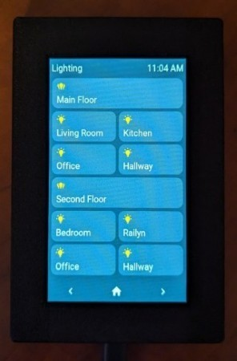
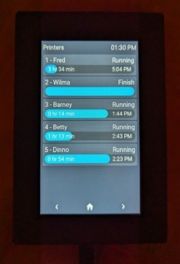
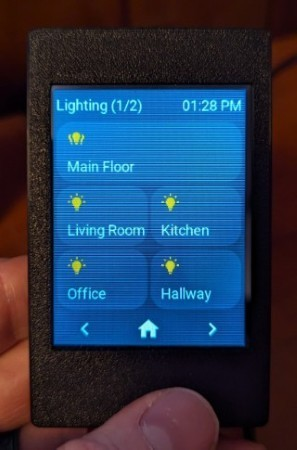

# ESPHome + LVGL on cheap touchscreen devices

## Supported Devices
* Sunton `ESP32-2432S028R` - 2.8" with resistive touch and USB micro-B.
* Sunton `ESP32-8048S043` - 4.3" with capactivive touch and USB-C.
* Sunton `ESP32-8048S050` - 5.0" with capactivive touch and USB-C.
* Elecrow CrowPanel `DIS05035H` (v2.2) - 3.5" with resistive touch and USB-C.

## File Structure
If all you are looking for is a device-specific config then look no further than the `devices/` directory. The YAML files in there are clean and free from anything not related to the devices themselves. They are intended to be used as [Packages](https://esphome.io/components/packages.html) in a higher-level YAML config file, which allows for device-specific settings and common settings to be kept in separate files, avoiding duplicate code and making it easier to update groups of devices. 

The YAML files in the root of this repo demonstrate how to use each device's config file with a common config, as well as a resolution-specific (but not device-specific) LVGL config/layout. 

## Advanced YAML Techniques
Aside from the Packages feature used to separate device-specfic YAML from common YAML config, there are some other potentially unfamiliar techniques in use here. For example, the files within `layouts/` use [YAML anchors and aliases](https://ref.coddy.tech/yaml/yaml-anchors) which help reduce code duplication. I use anchors and aliases instead of `style_definitions` and `styles` as anchors can be used on anything instead of being restricted to just styles, and because they override `theme` settings when used (there is a bug or perhaps odd design choice that prevent `styles` from overriding `theme`). I define most of my anchors within a made-up section called `.sizing` because top-level sections prefixed with a period do not cause errors when parsed by ESPHome. 

## Todo
This readme isn't finished. I'll be elaborating on some more techniques being used in here, such as the modularization of the widgets using `!include` and how the stateful widget files relate to their sensor counterparts (tip, just make sure to pass the same `uid` and `entity_id` when including a widget and when including the related widget sensor).

## Photos
4.3" 800x480  

3.5" 480x320  

2.8" 320x240  

